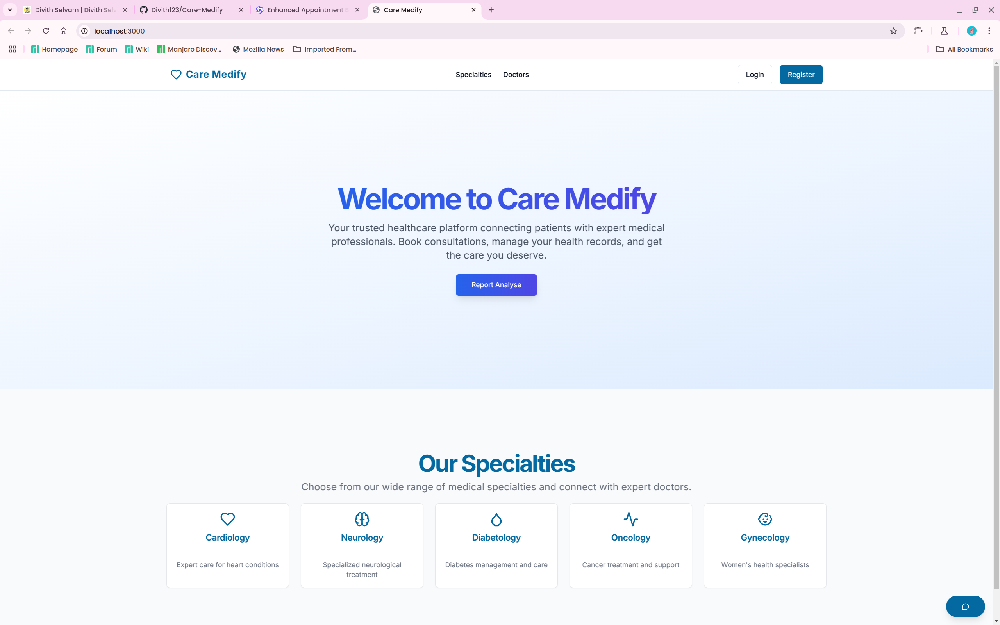
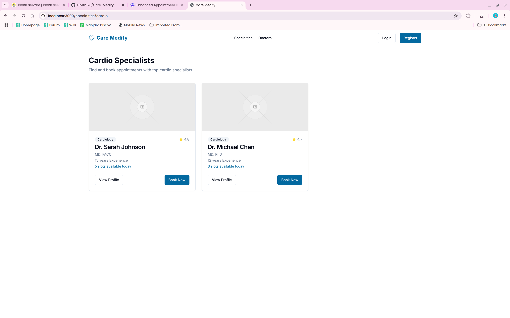
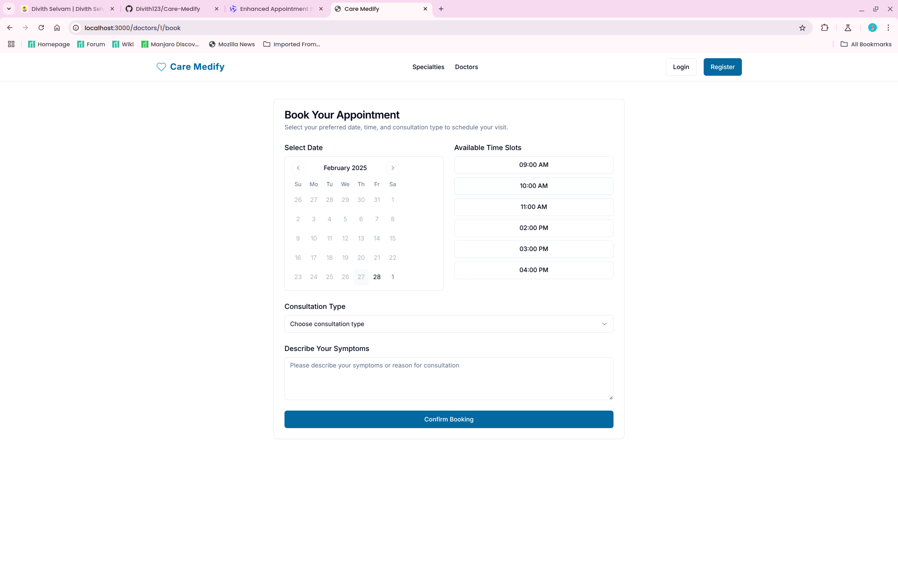
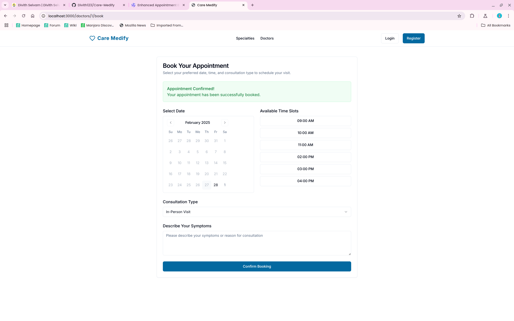
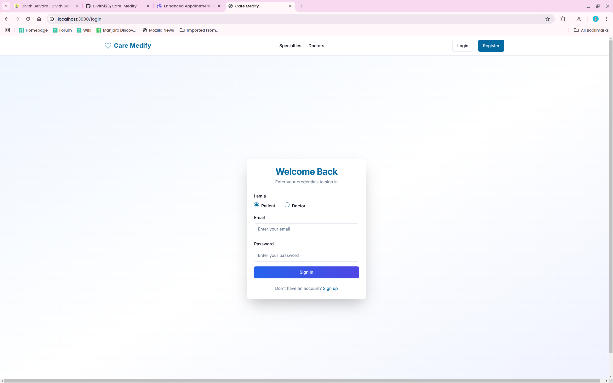
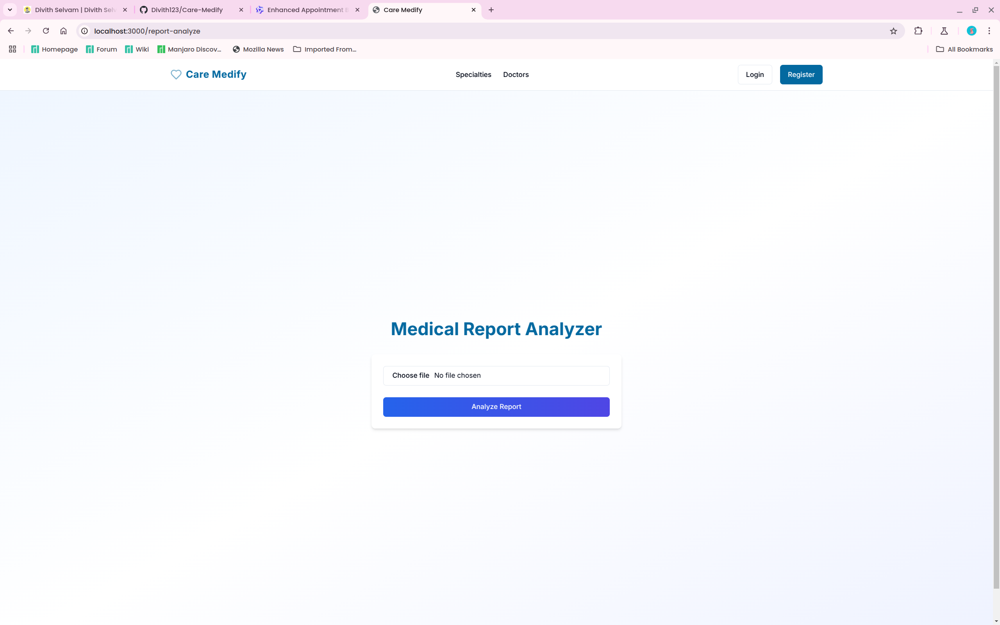

# 🏥 Care Medify - Appointment Booking System

Care Medify is a modern, intuitive web application designed to streamline the appointment booking process for patients and healthcare providers. Built with cutting-edge technologies like Next.js, Shadcn/ui, and Tailwind CSS, Care Medify offers a seamless user experience with features such as doctor search, appointment scheduling, report analysis, and more.

---

## 🌟 Features

### Core Features
- **Doctor Search**: Browse doctors by specialty and view detailed profiles.
- **Appointment Booking**: Select a date, time slot, and consultation type (video or in-person).
- **Report Analysis**: Upload medical reports for analysis.
- **Authentication**: Secure login and registration for patients.
- **Chatbot Integration**: Get instant assistance with our AI-powered chatbot.

### Additional Features
- **Responsive Design**: Optimized for mobile and desktop devices.
- **Accessibility**: ARIA roles and live regions for screen readers.
- **Reusable Components**: Powered by Shadcn/ui for a consistent UI.

---

## 🛠 Technologies Used

| Technology       | Description                                                                 |
|------------------|-----------------------------------------------------------------------------|
| **Next.js**      | React-based framework for server-side rendering and routing.               |
| **Shadcn/ui**    | Customizable and reusable UI components.                                   |
| **Tailwind CSS** | Utility-first CSS framework for rapid styling.                            |
| **React Hooks**  | State management with `useState`, `useEffect`, and custom hooks.           |
| **Sonner**       | Toast notifications for user feedback.                                     |
| **Groq**         | Querying data efficiently.                                                 |

---

## 🚀 Installation

### Prerequisites

- Node.js (v16 or higher)
- npm or yarn

### Steps

1. Clone the repository:

   ```bash
   git clone https://github.com/your-username/Care-Medify.git
   cd Care-Medify
   ```

2. Install dependencies:

   ```bash
   npm install
   ```

   or

   ```bash
   yarn install
   ```

3. Start the development server:

   ```bash
   npm run dev
   ```

4. Open the application in your browser:

   ```
   http://localhost:3000
   ```

## 🔑 Patient Login Support

To test the patient login functionality, use the following credentials:

| Email                  | Password   | Type   |
|------------------------|------------|------------|
| patient@gmail.com | `12345678` | `patient` |

### Steps to Log In:
1. Navigate to the `/login` page.
2. Enter the email and password from the credentials above.
3. Click the "Login" button to access the patient dashboard.

---

## 📸 Screenshots

Here are some screenshots of the application in action:

| Feature               | Screenshot                          |
|-----------------------|--------------------------------------|
| **Home Page**         |               |
| **Doctor Search**     |           |
| **Appointment Booking** |    |
| **Login Page**        |              |
| **Report Analysis**   |         |
| **Chatbot Integration** |                |

---

## 📂 Folder Structure

```plaintext
Care-Medify/
├── app/                     # Next.js pages and routing
│   ├── api/                 # API routes (e.g., file upload)
│   ├── doctors/             # Doctor-related pages
│   ├── login/               # Login page
│   ├── register/            # Registration page
│   ├── report-analyze/      # Report analysis page
│   ├── specialties/         # Specialty-based doctor listings
│   ├── globals.css          # Global styles
│   └── layout.tsx           # Root layout
├── components/              # Reusable UI components
│   ├── chatbot-button.tsx   # Chatbot integration
│   ├── navbar.tsx           # Navigation bar
│   ├── ui/                  # Shadcn/ui components
│   └── theme-provider.tsx   # Theme provider for dark/light mode
├── hooks/                   # Custom React hooks
├── lib/                     # Utility functions and services
├── public/                  # Static assets (images, logos, etc.)
├── styles/                  # Global CSS styles
├── tailwind.config.js       # Tailwind CSS configuration
└── tsconfig.json            # TypeScript configuration
```

---

## 🤝 Contributing

We welcome contributions from the community! To contribute:

1. Fork the repository.
2. Create a new branch for your feature or bug fix:

   ```bash
   git checkout -b feature/your-feature-name
   ```

3. Commit your changes:

   ```bash
   git commit -m "Add your descriptive commit message"
   ```

4. Push your changes:

   ```bash
   git push origin feature/your-feature-name
   ```

5. Open a pull request on GitHub.

---

## 📜 License

This project is licensed under the MIT License. See the [LICENSE](LICENSE) file for details.

---

## 📧 Contact

For questions or feedback, feel free to reach out:

- Email: [divithselvam23@gmail.com](mailto:divithselvam23@gmail.com)
- GitHub: [@Divith123](https://github.com/Divith123)

---

### 🌟 Show Your Support

If you find this project useful, give it a ⭐️ on GitHub! Your support motivates us to keep improving.
